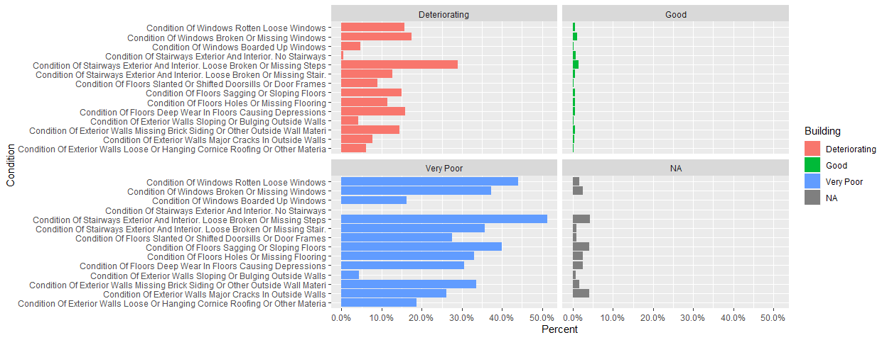
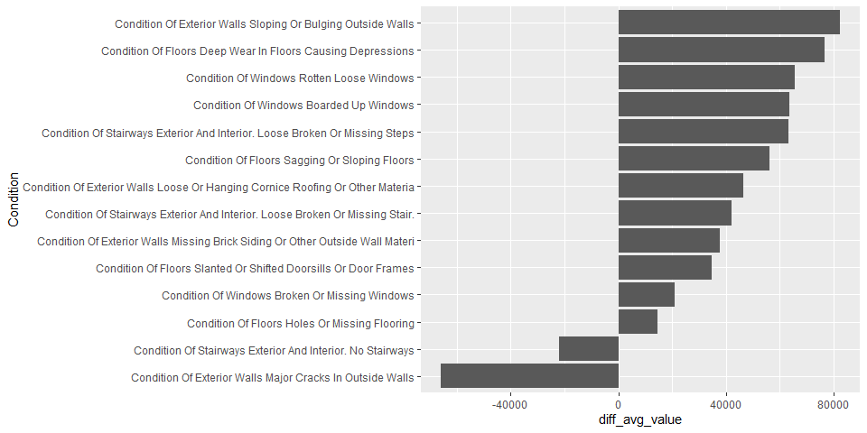
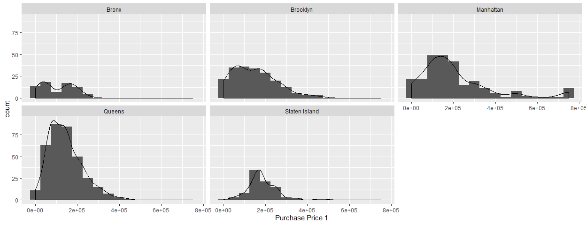

Getting Started
================
Ahern Nelson
March 18, 2019

Introduction
------------

The intention of this document is to help get everyone familiar with what I've been doing with the data, some of the questions and ideas I have, and hopefully help anyone get started on asking their own questions about the data.

Thus far I've only been looking at the 1991 dataset which I've pushed to the repository as *"house91.csv"*. I have not been using the first row as the headers as we have been for the homework, and instead have been using the second line. I'm doing this out of personal preference, but also because *dplyr* offers some nice tools for dealing with the column names. It's also significantly easier to read in the data using the second line as headers by specifying the argument *s**k**i**p* = 1 in the **read.csv()** call which skips the first line of the csv entirely.

For example:

``` r
data <- read.csv("house91.csv", skip=1)
```

#### About Column Names/Headers

When a data frame has column names or headers with white space in the names R will replace that white space with periods. So, if we look at the first few names of our data we get this.

``` r
library(dplyr)
data %>% names() %>% head(n=4)
```

    ## [1] "Record.Type"                                                                     
    ## [2] "Borough"                                                                         
    ## [3] "Condition.of.Exterior.Walls..Missing.brick..siding..or.other.outside.wall.materi"
    ## [4] "Condition.of.Exterior.Walls..Sloping.or.bulging.outside.walls"

This doesn't look all that great, especially when we start plotting the data, so I like to get rid of these periods using a custom function invloving regular expressions. The code below replaces the periods with spaces and capitalizes the leading character of each word.

``` r
smart_name <- function(x) {
  gsub("(^|[^[:alnum:]])([[:alnum:]])", " \\U\\2", x, perl = TRUE) %>%
    trimws("left")
}
data <- read.csv("house91.csv",skip = 1)
oldNames <- data %>% select(contains("..")) %>% names()
newNames <- gsub("\\.\\.","\\.",oldNames,fixed = F)
smartNames <- data %>% rename_at(vars(oldNames), ~newNames) %>% names()%>% smart_name()
data <- data %>% rename_all(~smartNames)
```

Now if we look at the new names

``` r
data %>% names() %>% head(n=4)
```

    ## [1] "Record Type"                                                                  
    ## [2] "Borough"                                                                      
    ## [3] "Condition Of Exterior Walls Missing Brick Siding Or Other Outside Wall Materi"
    ## [4] "Condition Of Exterior Walls Sloping Or Bulging Outside Walls"

To access columns with spaces in the name we have to use backquotes. The backquote key is generally to the left of the 1 key on your keyboard.

``` r
data$`Record Type` # or
data %>% select(`Record Type`) #or(if appropratie)
data %>% select("Record Type")
```

It's not important to understand the code here. You should use whatever naming convention you like, but it is important to know that if our data frames have different names we can't immediately transfer an analyses between workflows.

We can work around this by renaming the data as needed. Something like

``` r
your_data %>% names() -> your_names
my_data %>% rename_all(~your_names) %>%
  select(one_of_your_names)
```

Eventually, we will probably want to decide on a common naming convention for the columns we use in our project.

Recoding the data
-----------------

There are many ways to recode the values in each column. The following explains my approach. To recode the data I have been using variations of the **mutate()** and **recode()** functions from **dplyr**. I found the **recode()** function by looking through the **dplyr** documentation at <https://dplyr.tidyverse.org/>. There are many different variants of **dplyr** functions that you can read more about there.

Recode a single column

``` r
data %>% mutate(`Condition Of Building` = recode(`Condition Of Building`,
         `1` = "Very Poor",
         `2` = "Good",
         `3` = "Deteriorating",
         `8` = NA_character_)) -> data
```

Recode multiple columns using *mutate\_at*

``` r
data %>% select(contains("Condition")) %>% 
  select(-one_of("Condition Of Building")) %>% names() -> conditions
data %>% mutate_at(vars(conditions), recode, 
                    `1`="Yes", 
                    `8`= NA_character_, 
                    `9`= "No") -> data
```

Note the numbers being recoded have to be surrounded in backquotes, **mutate\_at()** takes a collection of column variables wrapped in the **vars()** function and applies a specifed function (*e.g.,* recode) to each column. I generally use this to recode everything, including single columns, becuase I don't have write the whole column name out.

For example:

``` r
data %>% mutate_at(vars(contains('Sex')), recode,
                   `1` = "Male",
                   `2` = "Female") -> data
```

    ## Warning: Unreplaced values treated as NA as .x is not compatible. Please
    ## specify replacements exhaustively or supply .default

I'm slowly working on recoding columns as needed instead of trying to recode all of them. You can look at all of the recoded variables thus far in the *"Cleaning script.R"* file.

Exploratory Data Analysis
-------------------------

You can find all the code used to produce these plots in *"eda.R"*

Ultimately the goal is to build an index measuring the housing conditions, so I was mostly interested in the columns concerning all the different conditions being recorded. In addition to these columns there is a qualitative column concering the percieved building condtion. SO my first question was how this value related to the individual conditions of the unit in the building.



This is informative, in that very few of the "Good" buildings have surveyed units with poor conditions. However, it is not clear from the graph how many buildings are of "Good" condition compared to how many are "Very Poor". It's also not clear how different combinations of conditions work here.

We can address the sample size concern in **dplyr**

``` r
data %>% group_by(`Condition Of Building`) %>%
  summarise(count=n())
```

    ## # A tibble: 4 x 2
    ##   `Condition Of Building` count
    ##   <chr>                   <int>
    ## 1 <NA>                      139
    ## 2 Deteriorating            1258
    ## 3 Good                    13341
    ## 4 Very Poor                 161

The sample proportion of "Very Poor" buildings is pretty small. We might want to look at how these values shift over time. Keep in mind that these values are determined by observation and may not be the most accurate.

Next I wanted to know if these condition had any affect on the value of the unit. I calculated the average value for units with and without a contion and took there difference. 

    ## # A tibble: 14 x 5
    ##    Condition                 diff_avg_value no_count yes_count plot_text   
    ##    <fct>                              <dbl>    <int>     <int> <chr>       
    ##  1 Condition Of Exterior Wa~        -65943.     3664        10 "#No: 3664\~
    ##  2 Condition Of Stairways E~        -22064.     3637        28 "#No: 3637\~
    ##  3 Condition Of Floors Hole~         14574.     3656        13 "#No: 3656\~
    ##  4 Condition Of Windows Bro~         20880.     3646        28 "#No: 3646\~
    ##  5 Condition Of Floors Slan~         34520.     3663         6 "#No: 3663\~
    ##  6 Condition Of Exterior Wa~         37627.     3632        42 "#No: 3632\~
    ##  7 Condition Of Stairways E~         42178.     3653        12 "#No: 3653\~
    ##  8 Condition Of Exterior Wa~         46255.     3652        22 "#No: 3652\~
    ##  9 Condition Of Floors Sagg~         56310.     3655        14 "#No: 3655\~
    ## 10 Condition Of Stairways E~         63131.     3627        38 "#No: 3627\~
    ## 11 Condition Of Windows Boa~         63649.     3673         1 "#No: 3673\~
    ## 12 Condition Of Windows Rot~         65508.     3641        33 "#No: 3641\~
    ## 13 Condition Of Floors Deep~         76485.     3661         8 "#No: 3661\~
    ## 14 Condition Of Exterior Wa~         82349.     3668         6 "#No: 3668\~

Unfortunately, there is a huge discrepancy between the number of units with and without these conditions and it is not appropraite to compare averages between the populations. Although, we should consider substituting value for other numerical data like rent or other monthly costs.

A great thing to do when just gettting started with data is to make histograms or boxplots of numerical data with respect to some category. For example we might look at purchase price distributions per Borough

``` r
ggplot(data,aes(`Purchase Price 1`)) + geom_histogram(binwidth = 5e+04) + 
  geom_density(aes(y=5e+04*..count..)) +
  facet_wrap(facets = ~Borough)
```

    ## Warning: Removed 13932 rows containing non-finite values (stat_bin).

    ## Warning: Removed 13932 rows containing non-finite values (stat_density).


